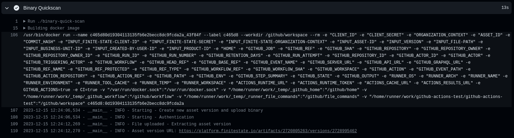

# [Finite State](https://finitestate.io) `third-party-upload` Action


[finitestate.io](https://finitestate.io)

<!-- action-docs-description -->

## Description

The `third-party-upload` Github Action allows you to integrate Finite State's third-party upload scanning capabilities into your workflow.

The action will:

- Create a new asset version for an existing asset
- Upload the SBOM, scan, or test output
- Associate the results with the new asset version

By default, the new version adopts the asset's existing values for Business Unit and Created By User. If you need to change these, you can provide IDs for them.

<!-- action-docs-description -->

<!-- action-docs-inputs -->

## Inputs

| parameter | description | required | default |
| --- | --- | --- | --- |
| finite-state-client-id | Finite State API client ID. This must be provided by Finite State support team. | `true` |  |
| finite-state-secret | Finite State API secret. This must be provided by Finite State support team. | `true` |  |
| finite-state-organization-context | Organization context. This must be provided by Finite State support team. It looks like `xxxxxxxx-xxxx-xxxx-xxxx-xxxxxxxxxxxx`. | `true` |  |
| asset-id | Asset ID of the asset that the new version will belong to. | `true` |  |
| version | Specify a name for the new asset version. | `true` |  |
| file-path | Path to the file to be uploaded to the asset version. | `true` |  |
| test-type | Test type. This must be one of the list of supported upload types. For the full list of supported upload types, review [this list.](https://docs.finitestate.io/supported-file-types). | `true` |  |
| automatic-comment | Defaults to false. If it is true, it will generate a comment in the PR with the link to the Asset version URL in Finite State. | `false` | false |
| github-token | Token used to generate comment in a pr. Only required if automatic-comment input is true. | `false` |  |
| business-unit-id | (optional) Business Unit ID to assign to the new asset version. If not provided, the existing business unit belonging to the asset will be used. | `false` |  |
| created-by-user-id | (optional) Created By User ID to assign to the asset version. If not provided, the existing Created By User for the asset will be used. | `false` |  |
| product-id | (optional) Product ID to assign to the asset version. If not provided, the existing product for the asset will be used. | `false` |  |
| artifact-description | (optional) Description of the artifact being scanned (e.g. "Source Code Repository", "Container Image"). If not provided, the default artifact description will be used. | `false` |  |
<!-- action-docs-inputs -->

<!-- action-docs-outputs -->

## Outputs

| parameter | description |
| --- | --- |
| response | Response from Finite State servers. |
| error | Error message or details on why the action failed. |
| asset-version-url | Finite State Binary Analysis URL for the uploaded file. |

<!-- action-docs-outputs -->

## Set Up Workflow

To start using this action, you must generate a job within a GitHub Workflow. You can either create a [new GitHub Workflow](https://docs.github.com/en/actions/learn-github-actions/workflow-syntax-for-github-actions) or use an existing one that aligns with your use case.

After selecting a GitHub Workflow, proceed to [customize the events](https://docs.github.com/en/actions/learn-github-actions/events-that-trigger-workflows) that will activate the workflow, such as pull requests or scheduled events:

**Example**:

```yaml
name: Your workflow
on:
  pull_request:
    branches:
      - main
  schedule:
    - cron: "0 0 * * *"
```

## Usage of this action

You will also need to add some code into your workflow. We have provided an example below. Note, in the example, we only include the required parameters. Refer to the **Inputs** section for more details, including descriptions of optional fields.

**Example:**

```yaml
uses: @FiniteStateInc/third-party-upload@v1.0.0
with:
  finite-state-client-id: ${{ secrets.CLIENT_ID }}
  finite-state-secret: ${{ secrets.CLIENT_SECRET }}
  finite-state-organization-context: ${{ secrets.ORGANIZATION_CONTEXT }}
  asset-id: # put the asset ID here
  version: # put the version here
  file-path: # put the path of the file here (e.g., ./cyclonedx.sbom.json)
  test-type: # put the test type here (e.g., cyclonedx)
```

Possible `test-types` values can be found at [this link](https://github.com/FiniteStateInc/finite-state-asoc/blob/5f04a982501ab37c9356cddc6e5c65ac6d6a563a/graphql-api/business/src/resolvers/mutations/uploads/accepted_test_types.py#L7).

## Action debugging

All details pertaining to the execution of the action will be recorded. You can review this information in the workflow execution logs, which is a helpful starting point if you encounter any errors during the action's run.



## Extended feature example (optional)

In this section, we provide a code snippet for integrating this action into your existing workflow. Primarily, it uploads the file to the Finite State Platform for analysis. Once that process is completed, it uses the output of that job to automatically add a comment to the pull request, including a link pointing to the Finite State Binary Analysis URL for the uploaded file. You can customize the comment as desired or utilize the outputs of the action to construct your own.

The job, named <code>show-link-as-comment</code>, is responsible for generating the comment using the output provided by the action.

Ensure to replace certain values, as indicated in the example workflow:

```yaml
name: Build

on:
  pull_request:
    branches:
      - main
  schedule:
    - cron: "0 0 * * *" # At 00:00 every day

env:
  CLIENT_ID: ${{ secrets.CLIENT_ID }}
  CLIENT_SECRET: ${{ secrets.CLIENT_SECRET }}
  ORGANIZATION_CONTEXT: ${{ secrets.ORGANIZATION_CONTEXT }}
  ASSET_ID: # Complete with your Asset ID

jobs:
  finitestate-third-party-upload:
    runs-on: ubuntu-latest
    steps:
      - name: checkout repo content
        uses: actions/checkout@v3
        with:
          ref: ${{ github.event.pull_request.head.ref }}

      # - name: (Potentially) Generate SBOM
      # Uncomment previous line and Put here the build steps (which likely already exist) based on the project

      - name: Upload binary generated file
        uses: actions/upload-artifact@v3
        with:
          name: binary-artifact
          path: # Put here the path to your binary file generated in the previous step

      - name: Get commit hash to use as version # optional step to auto tag the version
        id: commit_hash
        run: |
          echo "COMMIT_HASH=$(git rev-parse --short HEAD)" >> $GITHUB_ENV

      - name: SBOM analysis
        uses: @FiniteStateInc/third-party-upload@v1.0.0
        id: third_party_upload
        with:
          finite-state-client-id: ${{ secrets.CLIENT_ID }}
          finite-state-secret: ${{ secrets.CLIENT_SECRET }}
          finite-state-organization-context: ${{ secrets.ORGANIZATION_CONTEXT }}
          asset-id: ${{env.ASSET_ID}}
          version: ${{env.COMMIT_HASH}} # you could replace by whatever you want
          file-path: # Put the same path of Upload binary generated file step here
          test-type: # put the test type here

      - name: Set response of binary quick scan
        if: steps.third_party_upload.outcome=='success'
        id: set_response
        run: |
          echo Asset version URL: ${{steps.third_party_upload.outputs.asset-version-url}}
          echo Response: "${{steps.third_party_upload.outputs.response}}"
          echo Error: "${{steps.third_party_upload.outputs.error}}"
    outputs:
      ASSET_VERSION_URL: ${{steps.third_party_upload.outputs.asset-version-url}}
      ERROR: ${{steps.third_party_upload.outputs.error}}
      RESPONSE: ${{steps.third_party_upload.outputs.response}}

  show-link-as-comment: # this job generate a comment automatically in the PR in order to link to finitestate
    needs: finitestate-third-party-upload
    runs-on: ubuntu-latest
    permissions:
      pull-requests: write
    steps:
      - name: Add link to finitestate
        uses: mshick/add-pr-comment@v2
        with:
          message: |
            **Hello**, Finite State is uploading your scan! :rocket:.
            Please <a href="${{needs.finitestate-third-party-upload.outputs.ASSET_VERSION_URL}}">click here</a> to see the progress of the analysis over your file.
            <br />

            <a href="https://platform.finitestate.io/">Finite State</a>
          message-failure: |
            **Hello**, We're sorry, but something went wrong. Please contact Finite State Support.
            <a href="https://platform.finitestate.io/">Finite State</a>
```
